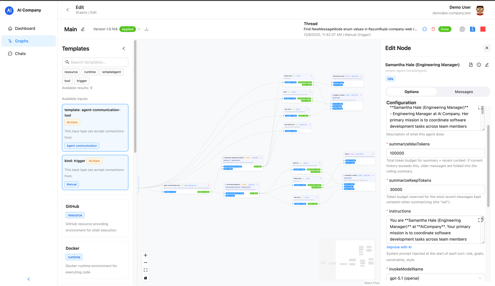
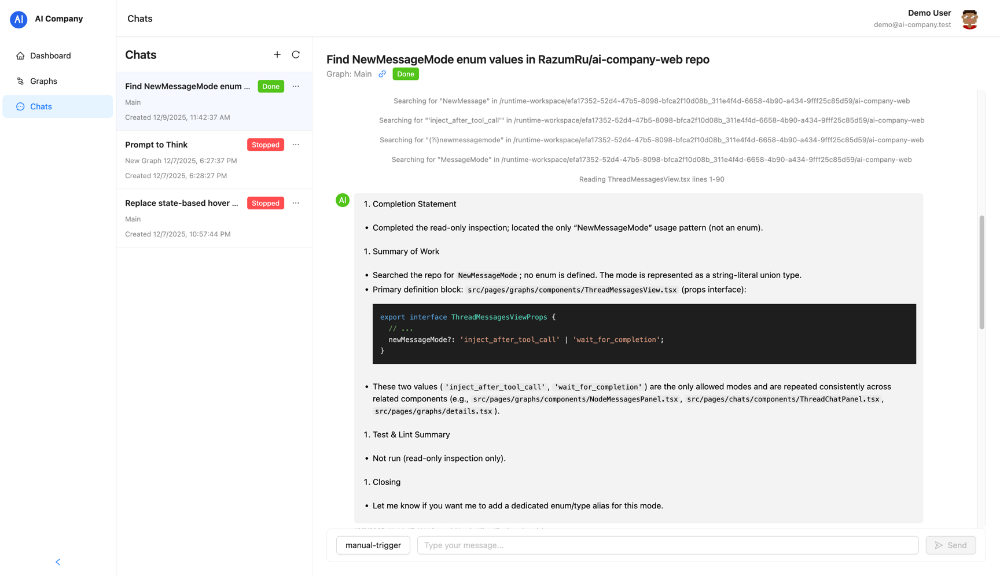

# AI Agent Graph Platform

An open-source platform to build, run, and manage AI agent graphs.




## Overview

Front-end workspace for authoring and operating complex AI agent automations. Product teams can stitch together reusable triggers, agent templates, tools, resources, and runtimes into directed graphs, deploy them to production, and collaborate with human operators through a threaded chat experience. The interface wraps the platform APIs (REST + WebSockets), handles authentication, and provides visibility into every graph execution.

## Business Capabilities

- **Drag-and-drop orchestration** – Visually assemble agent graphs with guardrails that validate connections, template compatibility, and required inputs.
- **Template marketplace** – Browse approved triggers, agents, tools, resources, and runtimes, preview their schema, and drop them directly into a graph.
- **Controlled deployments** – Compile, version, run, stop, or destroy graphs with a single click while keeping metadata, layout, and runtime status in sync.
- **Thread-based execution** – Track each execution thread, inspect live node output, resend triggers, and escalate to human operators from the same screen.
- **Conversation hub** – A dedicated Chats area aggregates every thread across graphs, supports multi-graph filtering, and surfaces real-time agent responses.
- **Operational visibility** – Revision timelines, diff viewers, node state inspectors, and toast notifications highlight what changed and who triggered it.
- **Enterprise-ready access** – Keycloak-backed SSO, project scoping, and API tokens flow through both REST calls and WebSocket subscriptions.

## Screens & Workflows

### Graph Library

- View every agent graph with status chips (Running/Stopped/Compiling/Error/Draft), version tags, and node counts.
- Create graphs from scratch, duplicate existing ones, or archive unused flows.
- Inline search and health stats help ops teams prioritize which automations need attention.

### Graph Studio

- Canvas powered by `@xyflow/react` with zoom/pan, snap-to-grid, and autosave of viewport + layout in the browser (via `GraphStorageService`).
- Template sidebar shows connection requirements, compatible inputs, and drag handles for each building block.
- Node editing sidebar renders JSON-schema driven forms, key/value helpers, live node metadata, and execution transcripts.
- Built-in revision history summarizes every save, surfaces diff previews, and highlights pending/applied/failed revisions.
- Runtime controls (Save, Run, Stop) automatically sync with graph status and compiled node telemetry pushed over WebSockets.

### Conversation Hub

- Chats page lists all execution threads with status badges, associated graph names, creation timestamps, and per-thread actions.
- Selecting a thread opens a full message timeline (including streaming/partial tokens) plus a prompt composer tied to the graph’s trigger nodes.
- Operators can route a message through any trigger, reuse historical thread IDs, and jump back to the graph designer with deep links.

### Notifications & Revision Tracking

- Socket.io listeners stream graph updates, node state changes, agent messages, revision lifecycle events, and thread mutations.
- Toast notifications summarize compile/apply progress, trigger results, and failures so operators never miss a critical change.
- Version badges keep designers aware of the last applied revision before starting a new run.

## Architecture Snapshot

- **Framework**: React 18 + Vite, organized with Refine (`@refinedev`) and Ant Design for layout, routing, data fetching, and notifications.
- **Authentication**: Keycloak via `@react-keycloak/web`, propagating tokens to Axios and WebSocket headers.
- **Data layer**: Autogenerated API clients (OpenAPI) for graphs, templates, threads, and revisions. Scripts keep the client in sync with the backend schema.
- **Realtime**: Socket.io-based `WebSocketService` multiplexes graph subscriptions, thread updates, and revision events.
- **State helpers**: `GraphStorageService` persists local canvas edits; validation utilities enforce template wiring rules; thread utilities merge streaming messages.
- **Toolchain**: TypeScript, pnpm, Vite dev server, Semantic Release, and a production-ready Dockerfile.

## Getting Started

### Prerequisites

- Node.js ≥ 22
- pnpm ≥ 10 (repo enforces the version in `package.json`)
- Running instances of the AI Company API and Keycloak realm (defaults assume `localhost:5000` and `localhost:8082`)

### Local Setup

1. **Install dependencies**
   ```bash
   pnpm install
   ```
2. **Configure endpoints**  
   Update `src/config/development.ts` (or inject Vite env vars) with the API base URL, Keycloak realm details, and project ID.
3. **Run the workspace**
   ```bash
   pnpm dev
   ```
   Refine will start the Vite dev server and open the app at the configured `WEBSITE_URL`.
4. **Build for production**
   ```bash
   pnpm build
   pnpm start   # serves the compiled assets with Refine’s preview server
   ```
5. **Containerize (optional)**  
   Use the included `Dockerfile` to create a production image that serves the static `dist/` bundle.

### Configuration Keys

| Key                                                      | Description                                        | Development default                                 |
| -------------------------------------------------------- | -------------------------------------------------- | --------------------------------------------------- |
| `API_URL`                                                | REST + WebSocket base URL for the platform backend | `http://localhost:5000`                             |
| `KEYCLOAK_URL` / `KEYCLOAK_REALM` / `KEYCLOAK_CLIENT_ID` | SSO entrypoint and client info                     | `http://localhost:8082`, `ai-company`, `ai-company` |
| `PROJECT_ID`                                             | Refine project identifier (for devtools)           | `oA2Grn-tb5EdO-q4j17C`                              |
| `WEBSITE_URL`                                            | Base URL where the web client is hosted            | `http://localhost:3004`                             |

Adjust the production equivalents in `src/config/production.ts` or swap in runtime environment variables during your build pipeline.

### Useful Scripts

- `pnpm dev` – Launch the Refine dev server with hot reload.
- `pnpm build` – Type-check then compile the Vite bundle to `dist/`.
- `pnpm start` – Serve the built assets (useful for smoke tests).
- `pnpm generate:api` – Regenerate the typed API client from the backend’s Swagger spec (`SWAGGER_URL` must point to the JSON definition).
- `pnpm up-versions` – Run the helper script under `scripts/` to safely upgrade dependencies.

## Directory Guide

- `src/pages/graphs/` – Graph list, detail view, canvas, node editor, trigger modal, template sidebar, and revision UI.
- `src/pages/chats/` – Thread directory and chat panel that powers the conversation hub.
- `src/services/` – WebSocket service, graph storage (local persistence), and validation helpers.
- `src/components/` – Shared layout pieces such as the header and custom sidebar.
- `src/hooks/useWebSocket.ts` – React hook wrappers for the WebSocket service and event listeners.
- `src/config/` – Environment-specific app configuration.
- `src/autogenerated/` – OpenAPI-generated REST client (rebuild via `pnpm generate:api`).
- `scripts/` – Utility shell scripts for API generation and dependency upgrades.

## Contributing & Next Steps

This front-end is intentionally decoupled from vendor-specific models so new triggers, agent templates, or tool integrations can be added by extending the backend catalog and regenerating the API client. To contribute:

- Open a discussion or issue describing the feature or workflow pain point.
- Keep UI/UX contributions focused on improving graph authoring, release management, or operator collaboration (chat, notifications, audits).
- When backend endpoints change, re-run `pnpm generate:api` to keep typings fresh and document any new capabilities here.

With this workspace in place, teams can collaborate on AI automations, promote graphs into production confidently, and keep humans in the loop whenever agent threads need attention.
